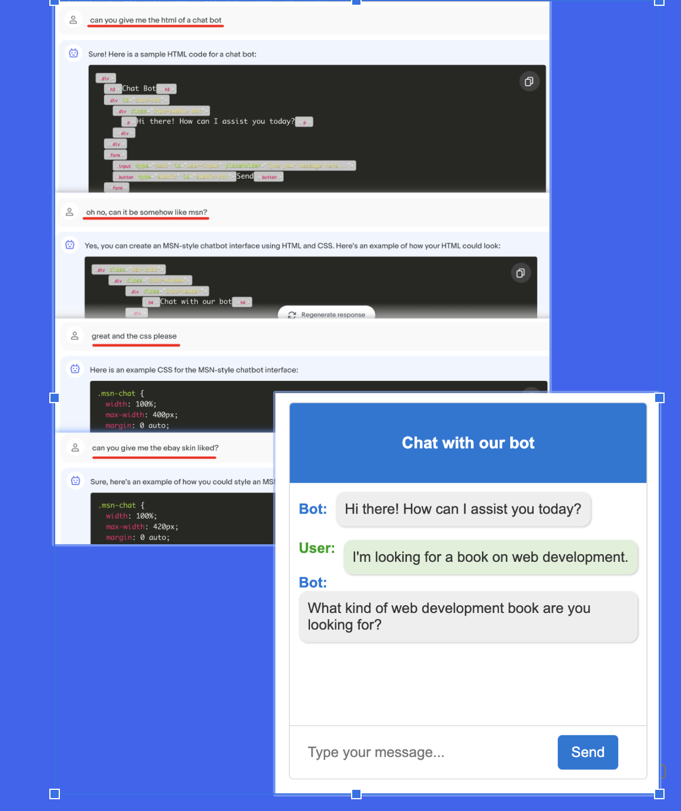
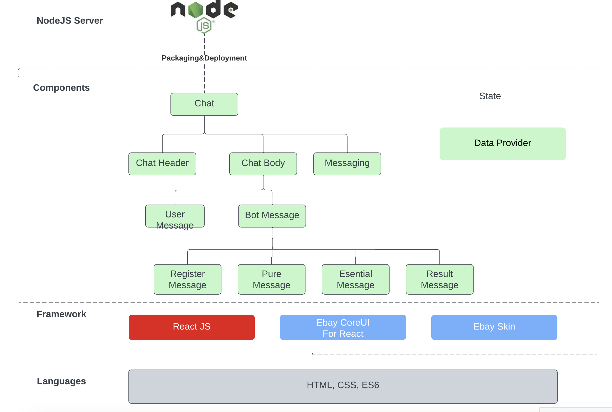

# Documents

## Mock server

`./Data/mock-server/readme.md`

## Serve

Serve the build(the static files) locally

`./build/readme.md `

## Libraries

1. ebay core ui react: https://github.com/eBay/ebayui-core-react

2. ebay skin:
   https://github.com/eBay/skin

3. antd: https://ant.design/docs/react/introduce

## Tricky things:

While using ebay skin, we found that there are many :root variables. But that variables are not by default found in the skin library. So i copy the :root from somewhere to index.html

# Loca1 test

1. Follow the steps in to start your mock server
   `./Data/mock-server/readme.md`

2. Run start script
   `yarn start`

# The stack

1. Use your favorite chat to generate a initial ui



2. The code base brief view



# Getting Started with Create React App

This project was bootstrapped with [Create React App](https://github.com/facebook/create-react-app).

## Available Scripts

In the project directory, you can run:

### `npm start`

Runs the app in the development mode.\
Open [http://localhost:3000](http://localhost:3000) to view it in your browser.

The page will reload when you make changes.\
You may also see any lint errors in the console.

### `npm run build`

Builds the app for production to the `build` folder.\
It correctly bundles React in production mode and optimizes the build for the best performance.

The build is minified and the filenames include the hashes.\
Your app is ready to be deployed!

See the section about [deployment](https://facebook.github.io/create-react-app/docs/deployment) for more information.

# Online learning

```js
// install prettier
npm install --save-dev --save-exact prettier
// set the prettier in. COMMAND+, -> Workspace -> Formatter "prettier"

```
